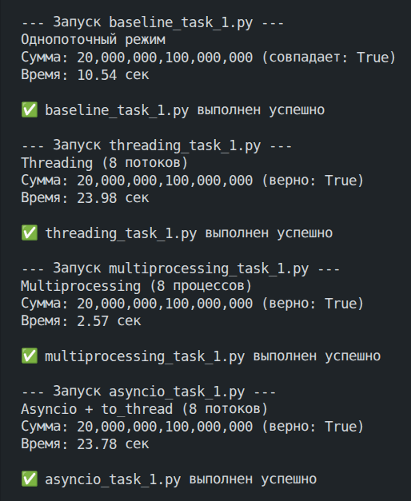

# Задача 1. Различия между threading, multiprocessing и async в Python

## Описание задания

**Задача:** Напишите три различных программы на Python, использующие каждый из подходов: `threading`, `multiprocessing` и `async`. Каждая программа должна решать считать сумму всех чисел от 1 до 10000000000000. Разделите вычисления на несколько параллельных задач для ускорения выполнения.

**Подробности задания:**

1. Напишите программу на Python для каждого подхода: `threading`, `multiprocessing` и `async`.
2. Каждая программа должна содержать функцию `calculate_sum()`, которая будет выполнять вычисления.
3. Для `threading` используйте модуль `threading`, для `multiprocessing` - модуль `multiprocessing`, а для `async` - ключевые слова `async/await` и модуль `asyncio`.
4. Каждая программа должна разбить задачу на несколько подзадач и выполнять их параллельно.
5. Замерьте время выполнения каждой программы и сравните результаты.

## Выполнение задания

Так как вычисление суммы всех чисел от 1 до N=10000000000000 (10^13) заняло бы слишком много времени, даже если использовать параллельные вычисления, то было решено уменьшить N до более маленького значения в `200_000_000`, которое с одной стороны позволит провести вычисления в разумное время, а с другой - всё-равно достаточно большое, чтобы увидеть разницу при применении разных подходов.

Далее были реализованы следующие программы:

### 1. `baseline_task_1.py`

Простое однопоточное решение "в лоб", которое будет использоваться в качестве эталона для оценки всех остальных подходов.

```py
import time


N = 200_000_000


def calculate_sum(start, end):
    total = 0
    for i in range(start, end + 1):
        total += i
    return total


def single_thread():
    start_time = time.perf_counter()
    total = calculate_sum(1, N)
    elapsed = time.perf_counter() - start_time
    return total, elapsed


if __name__ == "__main__":
    total, elapsed = single_thread()
    expected = N * (N + 1) // 2
    print(f"Однопоточный режим")
    print(f"Сумма: {total:,} (совпадает: {total == expected})")
    print(f"Время: {elapsed:.2f} сек")
```

### 2. `threading_task_1.py`

Программа, которая создаёт несколько отдельных потоков операционной системы и распределяет вычисления между ними.

```py
import threading
import time


N = 200_000_000
NUM_WORKERS = 8


def calculate_sum(start, end, results, idx):
    total = 0
    for i in range(start, end + 1):
        total += i
    results[idx] = total


def main_threading():
    step = N // NUM_WORKERS
    ranges = []
    for i in range(NUM_WORKERS):
        start = i * step + 1
        end = (i + 1) * step if i != NUM_WORKERS - 1 else N
        ranges.append((start, end))
    
    results = [0] * NUM_WORKERS
    threads = []
    start_time = time.perf_counter()
    
    for idx, (s, e) in enumerate(ranges):
        t = threading.Thread(target=calculate_sum, args=(s, e, results, idx))
        threads.append(t)
        t.start()
    
    for t in threads:
        t.join()
    
    elapsed = time.perf_counter() - start_time
    total = sum(results)
    return total, elapsed


if __name__ == "__main__":
    total, elapsed = main_threading()
    expected = N * (N + 1) // 2
    print(f"Threading ({NUM_WORKERS} потоков)")
    print(f"Сумма: {total:,} (верно: {total == expected})")
    print(f"Время: {elapsed:.2f} сек")
```

### 3. `multiprocessing_task_1.py`

Программа, которая создаёт несколько независимых процессов ОС (каждый процесс со своим интерпретатором Python) и распределяет вычисления между ними.

```py
import multiprocessing
import time


N = 200_000_000
NUM_WORKERS = 8


def calculate_sum(start, end):
    total = 0
    for i in range(start, end + 1):
        total += i
    return total


def main_multiprocessing():
    step = N // NUM_WORKERS
    ranges = []
    for i in range(NUM_WORKERS):
        start = i * step + 1
        end = (i + 1) * step if i != NUM_WORKERS - 1 else N
        ranges.append((start, end))
    
    start_time = time.perf_counter()
    with multiprocessing.Pool(processes=NUM_WORKERS) as pool:
        results = pool.starmap(calculate_sum, ranges)
    elapsed = time.perf_counter() - start_time
    
    total = sum(results)
    return total, elapsed


if __name__ == "__main__":
    multiprocessing.freeze_support()
    total, elapsed = main_multiprocessing()
    expected = N * (N + 1) // 2
    print(f"Multiprocessing ({NUM_WORKERS} процессов)")
    print(f"Сумма: {total:,} (верно: {total == expected})")
    print(f"Время: {elapsed:.2f} сек")
```

### 4. `asyncio_task_1.py`

Программа с использованием `asyncio` и `async/await`, которая создаёт несколько корутин в рамках одного потока и распределяет вычисления между ними.

```py
import asyncio
import time


N = 200_000_000
NUM_WORKERS = 8


def calculate_sum(start, end):
    total = 0
    for i in range(start, end + 1):
        total += i
    return total


async def calculate_sum_async(start, end):
    return await asyncio.to_thread(calculate_sum, start, end)


async def main_async():
    step = N // NUM_WORKERS
    ranges = []
    for i in range(NUM_WORKERS):
        start = i * step + 1
        end = (i + 1) * step if i != NUM_WORKERS - 1 else N
        ranges.append((start, end))
    
    tasks = [calculate_sum_async(s, e) for s, e in ranges]
    results = await asyncio.gather(*tasks)
    return sum(results)


def run_async():
    start_time = time.perf_counter()
    total = asyncio.run(main_async())
    elapsed = time.perf_counter() - start_time
    return total, elapsed


if __name__ == "__main__":
    total, elapsed = run_async()
    expected = N * (N + 1) // 2
    print(f"Asyncio + to_thread ({NUM_WORKERS} потоков)")
    print(f"Сумма: {total:,} (верно: {total == expected})")
    print(f"Время: {elapsed:.2f} сек")
```

### 5. `run_all.py`

Программа для запуска программ 1-4.

```py
import subprocess
import sys


scripts = [
    "baseline_task_1.py",
    "threading_task_1.py",
    "multiprocessing_task_1.py",
    "asyncio_task_1.py"
]


def run_script(script_name):
    print(f"\n--- Запуск {script_name} ---")
    try:
        result = subprocess.run(
            [sys.executable, script_name],
            check=False,
            capture_output=True,
            text=True
        )
        if result.stdout:
            print(result.stdout)
        if result.stderr:
            print("STDERR:", result.stderr, file=sys.stderr)
        if result.returncode != 0:
            print(f"⚠️  {script_name} завершился с кодом {result.returncode}")
        else:
            print(f"✅ {script_name} выполнен успешно")
        return result.returncode
    except FileNotFoundError:
        print(f"❌ Файл {script_name} не найден!", file=sys.stderr)
        return 1


def main():
    exit_codes = []
    for script in scripts:
        code = run_script(script)
        exit_codes.append(code)
    
    print("\n=== Итоговые коды возврата ===")
    for script, code in zip(scripts, exit_codes):
        print(f"{script}: {code}")
    
    if any(exit_codes):
        sys.exit(1)


if __name__ == "__main__":
    main()
```

### Результаты сравнения подходов

После запуска `run_all.py` были получены следующие результаты:



**Дадим трактовку полученным результатам:**

Для понимания результатов, важно в первую очередь отметить, что в Python есть такая вещь как **GIL (Global Interpreter Lock)** — это мьютекс (блокировка) внутри интерпретатора CPython (стандартной реализации Python), который не позволяет выполнять более одного потока байт-кода Python одновременно в рамках одного процесса.

Он нужен, так как упрощает управление памятью: сборщик мусора (подсчёт ссылок) становится потокобезопасным без тонких блокировок. Без GIL каждый объект защищал бы свой счётчик ссылок отдельной блокировкой, что сильно замедлило бы однопоточные программы.

В Python при попытке реализовать многопоточность, потоки честно переключаются, но в любой момент времени только один поток держит GIL и исполняет Python-код. Поток периодически отпускает GIL (например, каждые 100 тактов байт-кода или при операциях ввода‑вывода). Другие потоки ждут. Получается конкурентность без параллелизма для CPU‑интенсивных задач.

Так что практическая эффективность многопоточности в Python зависит от типа нагрузки:

* CPU‑нагрузка (суммирование чисел) → потоки постоянно борются за GIL, добавляются накладные расходы на переключения, но реального ускорения нет.
* I/O‑нагрузка (чтение с диска, сетевые запросы) → поток отпускает GIL на время ожидания, и другие потоки работают – ускорение возможно.

В рамках данной задачи мы работаем с CPU-нагрузкой, а значит что `threading`, который хотя и создаёт несколько потоков, но эти потоки всё-равно конкурируют за один GIL, что тем более `asyncio`, который вообще работает с корутинами в рамках одного потока, не приводят к повышению эффективности (при работе с CPU-нагрузкой), так как всё-равно работают лишь с одним GIL. Более того, они тратят дополнительное время для переключения между потоками и корутинами, в результате чего мы видим, что по времени выполнения они уступают даже базовому решению "в лоб" более чем в два раза. В результате, в задачах подобной этой, применение `threading` и `asyncio` неэффективно.

В то же время, единственный подход, который реально привёл к существенному сокращению времени выполнения - это `multiprocessing` (время выполнения относительно базового решения удалось сократить более чем в три раза). Всё дело в том, что в рамках `multiprocessing`, каждый процесс имеет собственный интерпретатор Python и свой GIL, поэтому код выполняется реально параллельно на разных ядрах процессора. Это делает `multiprocessing` эффективным и при работе с CPU-нагрузкой, при условии, что на устройстве есть несколько процессоров.

## Выводы

В рамках данной задачи, где нужно было работать с CPU-нагрузкой, можно сделать следующие выводы:

* Подходы `threading` и `asyncio` оказались неэффективны и показали даже худшее время выполнения, чем базовое решение, так как разбиение на потоки и корутин не позволяет решить проблему одного GIL, что при работе с CPU-нагрузкой всё-равно приводит к тому, что вычисления фактически выполняются последовательно (плюс тратится дополнительное время на переключение между потоками и корутинами).
* А вот `multiprocessing` позволил существенно сократить время выполнения задачи, так как создаёт отдельные процессы, каждый из которых имеет собственный GIL, что позволяет реально делать параллельные CPU-вычисления при условии наличия нескольких процессоров.
* Можно сделать общий вывод, что при работе с задачами с CPU-нагрузкой, из рассмотренных подходов имеет смысл использовать только `multiprocessing`, в то время как `threading` и `asyncio` лучше оставить для задач с I/O‑нагрузкой.
